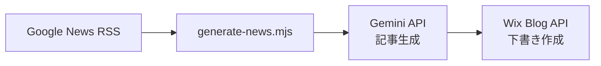

# article-generation (toushinotane-wix-bot)

金融ニュースを自動収集し、Google Gemini API で市況サマリー記事を生成して、Wix ブログの下書きとして自動投稿するボットです。金融メディア「投資の種」の日次記事作成を自動化します。

## 概要

1. Google News RSS（株式・為替・米国市場）から最新ヘッドラインを収集
2. Gemini API（`gemini-1.5-flash`）で個人投資家向けの日次市況サマリー記事（HTML）を生成
3. Wix Blog API（Draft Posts）へ下書きとして投稿

## 処理フロー



## ファイル構成

| ファイル | 説明 |
|---|---|
| [src/generate-news.mjs](src/generate-news.mjs) | 記事生成・投稿パイプラインのメインスクリプト |
| [.github/workflows/daily-market-news.yml](.github/workflows/daily-market-news.yml) | 毎日自動実行する GitHub Actions ワークフロー |

## セットアップ

### 必要な環境

- Node.js 20 以上

### インストール

```bash
npm ci
```

### 環境変数

| 変数名 | 必須 | 説明 |
|---|---|---|
| `GEMINI_API_KEY` | ✅ | Google Gemini API のキー |
| `WIX_API_KEY` | ✅ | Wix API キー |
| `WIX_SITE_ID` | ✅ | Wix サイト ID |
| `WIX_CATEGORY_ID` | 任意 | 投稿先カテゴリ ID（市況速報カテゴリなど） |

ローカルで実行する場合は `.env` ではなくシェルの環境変数として設定してください。

### 実行

```bash
npm start
```

## 自動実行（GitHub Actions）

[.github/workflows/daily-market-news.yml](.github/workflows/daily-market-news.yml) により、以下のスケジュールで自動実行されます。

- **スケジュール**: 毎日 UTC 21:30（日本時間 翌朝 06:30）
- **手動実行**: GitHub 管理画面の「Actions」タブから `workflow_dispatch` で実行可能

リポジトリの **Settings > Secrets and variables > Actions** に上記の環境変数を Secrets として登録してください。

## 生成される記事

- タイトル例: `【朝刊まとめ】2026年8月16日の金融市場動向と注目ポイント`
- 構成: リード文 → 本日のマーケット動向・注目材料 → トピック別解説 → 今後の注目イベント・経済指標 → 免責事項
- 投稿先: Wix ブログの**下書き**（公開は手動）

## 依存パッケージ

- `@google/generative-ai` — Gemini API クライアント
- `rss-parser` — RSS フィードの解析
- `axios` — Wix API への HTTP リクエスト

## 注意事項

本リポジトリが生成する記事は情報提供を目的としており、投資勧誘を目的としたものではありません。出典は Google News 配信各社です。
